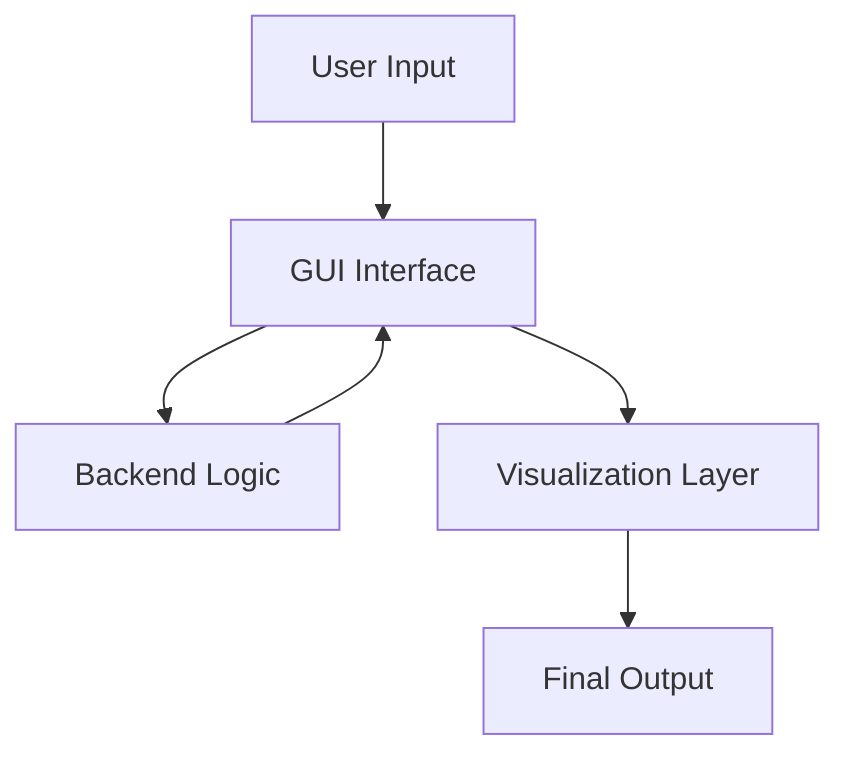

# IEEE 754 Floating-Point Calculator (Python GUI)

## Overview  
The IEEE 754 Floating-Point Calculator is a Python-based project that demonstrates how real numbers are represented and processed according to the IEEE 754 standard.  
It provides a user-friendly interface for conversion, arithmetic operations, and visualisation of floating-point numbers, making the concept easier to understand for learners and useful for practical applications.

---

## Features  
- **Decimal ↔ IEEE 754 Conversion** (32-bit single precision) & (64-bit Double Precision)
- **Binary ↔ Decimal Conversion** with validation  
- **Arithmetic Operations**: Addition and Multiplication  
- **GUI Interface** using Tkinter/PyQt  
- **Visualization Mode**: Color-coded breakdown of sign, exponent, and mantissa  
- **Learning Mode** (conceptual): Step-by-step explanation of conversion and computation  

---

## Architecture  
The project is structured into three primary components:  

1. **Backend (Core Logic)**  
   - Implements IEEE 754 encoding and decoding  
   - Handles arithmetic operations on floating-point numbers  
   - Provides functions callable by the GUI layer  

2. **GUI Layer**  
   - Collects input from the user  
   - Displays output in both decimal and binary IEEE 754 formats  
   - Manages buttons, validation, and user interaction  

3. **Visualization & Documentation Layer**  
   - Highlights the internal representation (Sign | Exponent | Mantissa)  
   - Provides step-by-step explanation in Learning Mode
   - Maintains documentation and presentation material

**High-Level Flow:**  

## Team Roles
**Ayush Aryan (Backend Developer)**
IEEE 754 conversion logic (decimal ↔ binary)
Arithmetic operations implementation
Core testing and validation

**Mukti Shree Jain (GUI Developer)**
GUI design and development
Integration of backend logic with the interface
Input validation and result presentation

**Vivek Kumar Prusty (Visualisation & Documentation)**
Visualisation of sign, exponent, and mantissa
Conceptual design for Learning Mode
Documentation, README, and project presentation

## Conclusion

The IEEE 754 Floating-Point Calculator demonstrates how floating-point arithmetic works inside computers clearly and interactively.
By combining backend accuracy, a practical GUI, and visual breakdowns, the project serves as both a calculator and a learning aid.
Future enhancements will expand its precision, features, and accessibility.
